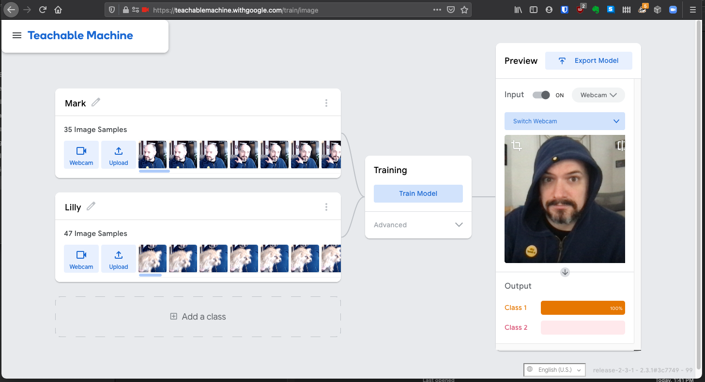

https://teachablemachine.withgoogle.com

Make at least two image classes, and train them on some stuff you have nearby. Test it. See if you can fool it! This should take 5-10 minutes total.

Turn in: a screenshot, like the one below. Upload it here.

