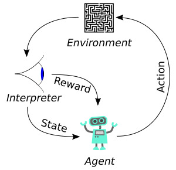

## A Beginner’s Guide To Reinforcement Learning With A Mario Bros Example
- https://towardsdatascience.com/a-beginners-guide-to-reinforcement-learning-with-a-mario-bros-example-fa0e0563aeb7

## Some fun stuff... Systems "learning" to exploit your well-intentioned system:
- 9 Examples of Specification Gaming
https://www.youtube.com/watch?v=nKJlF-olKmg (Links to an external site.)
- Faulty Reward Functions in the Wild
https://openai.com/blog/faulty-reward-functions/

 

## (Optional) if you want to try the Mario example:
- A guide to the Mario Brother Example: https://pytorch.org/tutorials/intermediate/mario_rl_tutorial.html
- The environment I set up with VSCode and Docker: https://github.com/IDDS-PML/rl-mario